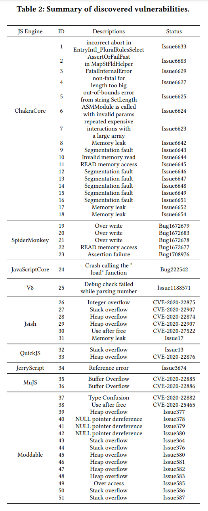

# Artifact Evaluation: SoFi

Unfortunately, the code of SoFi is not fully published as of today. Parts of it are available at their [website](https://sites.google.com/view/sofi4js/souce-and-data) or our [upstream mirror](https://github.com/fuzz-evaluator/SoFi-upstream).

With the code not fully available, no reproduction of results is possible. We urge authors to follow up with their pledges to release the source code of their tools.

As we cannot hope to reproduce any experiment, we study the discovered vulnerabilities reported by SoFi in major browser engines:

Studying the bug reports for the active browser engines, JavaScriptCore, SpiderMonkey, and v8, we observe the following:

| Target | bug ID | developer response | ticket status | notes |
| ------ | ------ | ------------------ | ------------- | ----- |
| SpiderMonkey | [bugzilla 1672679](https://bugzilla.mozilla.org/show_bug.cgi?id=1672679) | invalid | resolved | triggered in-built crash() function |
| SpiderMonkey | [bugzilla 1672683](https://bugzilla.mozilla.org/show_bug.cgi?id=1672683) | invalid | resolved | triggered in-built crash() function |
| SpiderMonkey | [bugzilla 1672678](https://bugzilla.mozilla.org/show_bug.cgi?id=1672678) | invalid | resolved | triggered in-built crash() function |
| SpiderMonkey | [bugzilla 1672677](https://bugzilla.mozilla.org/show_bug.cgi?id=1672677) | invalid | resolved | devs: does not reproduce, not security-sensitive |
| SpiderMonkey | [bugzilla 1708976](https://bugzilla.mozilla.org/show_bug.cgi?id=1708976) | duplicate | resolved | found on no-longer-supported build; non-reproducible on newer builds |	
JavaScriptCore | [222542](https://bugs.webkit.org/show_bug.cgi?id=222542) | invalid | open | devs: not a security issue |
| v8 | [issue 1188571](https://bugs.chromium.org/p/chromium/issues/detail?id=1188571) | non-reproducible | closed |	bug found on outdated version |

As visible from this, all seven vulnerabilities found in active JavaScript interpreters JavaScriptCore, SpiderMonkey, and v8 are invalid and not a vulnerability as claimed in the paper.

If including the discontinued ChakraCore (maintained by some community members at the time when the bugs were reported), we find that four of the 18 issues found in this interpreter have been confirmed or fixed, the others have been (1) ignored (10 times), (2) are not a bug (2 times), (3) a duplicate (1 time), or (4) non-reproducible (1 time). It remains unclear whether the four confirmed/fixed issues are security-sensitive, with at least one being judged to be not a security issue by the maintainers (#6623).

| Target | bug ID | developer response | ticket status | notes |
| ------ | ------ | ------------------ | ------------- | ----- |
| ChakraCore | [issue 6633](https://github.com/chakra-core/ChakraCore/issues/6633) | fixed | closed | |
| ChakraCore | [issue 6683](https://github.com/chakra-core/ChakraCore/issues/6683) | Duplicate of [#6637](https://github.com/chakra-core/ChakraCore/issues/6637) | open | |
| ChakraCore | [issue 6629](https://github.com/chakra-core/ChakraCore/issues/6629) | confirmed | open | |
| ChakraCore | [issue 6627](https://github.com/chakra-core/ChakraCore/issues/6627) | fixed | closed | |
| ChakraCore | [issue 6625](https://github.com/chakra-core/ChakraCore/issues/6625) | by-design | closed | |
| ChakraCore | [issue 6624](https://github.com/chakra-core/ChakraCore/issues/6624) | by-design | closed | |
| ChakraCore | [issue 6623](https://github.com/chakra-core/ChakraCore/issues/6623) | fixed | closed | devs: not a vulnerability |
| ChakraCore | [issue 6642](https://github.com/chakra-core/ChakraCore/issues/6642) | ignored | open | memory leak via LeakSanitizer |
| ChakraCore | [issue 6643](https://github.com/chakra-core/ChakraCore/issues/6643) | ignored | open | segmentation fault |
| ChakraCore | [issue 6644](https://github.com/chakra-core/ChakraCore/issues/6644) | ignored | open | |
| ChakraCore | [issue 6645](https://github.com/chakra-core/ChakraCore/issues/6645) | ignored | open | |
| ChakraCore | [issue 6646](https://github.com/chakra-core/ChakraCore/issues/6646) | ignored | open |
| ChakraCore | [issue 6647](https://github.com/chakra-core/ChakraCore/issues/6647) | non-reproducible | open | |
| ChakraCore | [issue 6648](https://github.com/chakra-core/ChakraCore/issues/6648) | ignored | open | |
| ChakraCore | [issue 6649](https://github.com/chakra-core/ChakraCore/issues/6649) | ignored | open | |
| ChakraCore | [issue 6651](https://github.com/chakra-core/ChakraCore/issues/6651) | ignored | open | |
| ChakraCore | [issue 6652](https://github.com/chakra-core/ChakraCore/issues/6652) | ignored | open | memory leak via LeakSanitizer |
| ChakraCore | [issue 6654](https://github.com/chakra-core/ChakraCore/issues/6654) | ignored | open | memory leak via LeakSanitizer |

